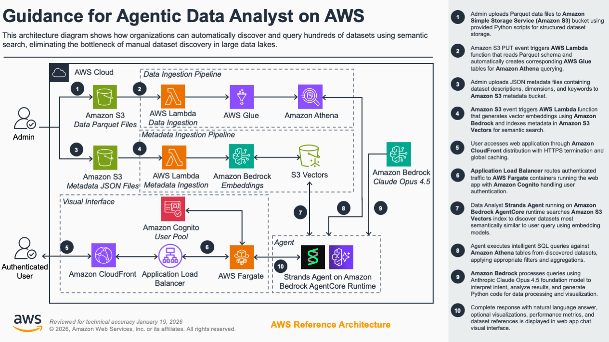
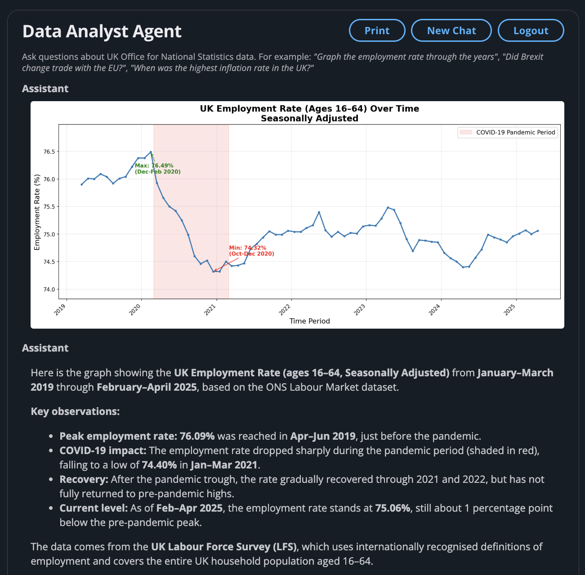

# Data Analyst Agent using Hundreds of Datasets on Amazon Athena

## Table of Contents

- [Data Analyst Agent using Hundreds of Datasets on Amazon Athena](#data-analyst-agent-using-hundreds-of-datasets-on-amazon-athena)
  - [Table of Contents](#table-of-contents)
  - [Overview](#overview)
    - [Cost](#cost)
    - [Sample Cost Table](#sample-cost-table)
  - [Prerequisites](#prerequisites)
    - [Operating System](#operating-system)
    - [aws cdk bootstrap](#aws-cdk-bootstrap)
  - [Deployment Steps](#deployment-steps)
  - [Deployment Validation](#deployment-validation)
  - [Running the Guidance](#running-the-guidance)
    - [Dataset Search Benchmark](#dataset-search-benchmark)
    - [Agent Benchmark](#agent-benchmark)
  - [Next Steps](#next-steps)
  - [Cleanup](#cleanup)
  - [Notices](#notices)
  - [Authors](#authors)

## Overview
Organizations often manage hundreds of datasets across their data lakes, making it difficult for analysts to discover which datasets contain the information they need. Traditional keyword-based search falls short when users don't know the exact terminology or structure of available data. This creates a bottleneck where valuable data remains underutilized simply because it's hard to find.

This guidance provides a scalable approach for deploying a Data Analyst Agent that can query hundreds of datasets hosted on **Amazon Athena**. Built on the **Strands Agents** framework and deployed on **AWS AgentCore**, the agent leverages semantic search powered by **Amazon S3 Vectors** to automatically identify and retrieve the most relevant datasets based on user queries.

For each new dataset added to the system, the admin must upload two files:
1. A **Parquet file** with the raw data, which initialises the corresponding Athena table.
2. A **JSON metadata file** with a dataset description, which creates a vector database entry enabling semantic discovery by the agent.

To showcase the solution's ability to handle hundreds of datasets, this guidance includes a ready-to-use script that downloads all `337` publicly available datasets from the UK Office for National Statistics (ONS) and generates the corresponding Parquet data and JSON metadata files, ready to be uploaded. Additionally, a demo Streamlit Web-Application is provided, allowing users to interact with and query the agent through an intuitive interface.



### Cost

_You are responsible for the cost of the AWS services used while running this Guidance. As of January 2026, the cost for running this Guidance with the default settings in the  US East (N. Virginia) is approximately $120.90 per month for processing 1,000 queries.

We recommend creating a [Budget](https://docs.aws.amazon.com/cost-management/latest/userguide/budgets-managing-costs.html) through [AWS Cost Explorer](https://aws.amazon.com/aws-cost-management/aws-cost-explorer/) to help manage costs. Prices are subject to change. For full details, refer to the pricing webpage for each AWS service used in this Guidance.

### Sample Cost Table

The following table provides a sample cost breakdown for deploying this Guidance with the default parameters in the US East (N. Virginia) Region for one month.

| AWS service  | Dimensions | Cost [USD] |
| ----------- | ------------ | ------------ |
| Amazon Bedrock foundation model (Anthropic Claude Haiku 4.5) | 1,000 invocations per month  | $ 70.20 |
| Amazon Bedrock AgentCore runtime | 1,000 sessions per month | $ 14.06 |
| Elastic Load Balancing | 1 Application Load Balancer | $ 16.45 |
| AWS Lambda | 317 dataset ingestion per month | $ 6.03 |
| AWS Fargate | Container running continuously for web application | $ 9.01 |
| Amazon Athena | 1000 requests per month | $ 4.88 |
| Amazon Simple Storage Service (S3) | 1 GB per month | $ 0.16 |
| Amazon CloudFront | 1000 requests per month | $ 0.11 |

## Prerequisites

### Operating System

- Talk about the base Operating System (OS) and environment that can be used to run or deploy this Guidance, such as *Mac, Linux, or Windows*. Include all installable packages or modules required for the deployment. 
- By default, assume Amazon Linux 2/Amazon Linux 2023 AMI as the base environment. All packages that are not available by default in AMI must be listed out.  Include the specific version number of the package or module.

**Example:**
“These deployment instructions are optimized to best work on **<Amazon Linux 2 AMI>**.  Deployment in another OS may require additional steps.”

- Include install commands for packages, if applicable.

### aws cdk bootstrap

<If using aws-cdk, include steps for account bootstrap for new cdk users.>

**Example blurb:** “This Guidance uses aws-cdk. If you are using aws-cdk for first time, please perform the below bootstrapping....”

## Deployment Steps
1. Install packages in requirements using command ```pip install -r requirements.txt```
2. From the `infrastructure` directory, deploy the stack with the CDK command: ```cdk deploy``` 
3. From the `agent` directory, run the scripts to deploy the the `337` ONS datasets:
   1. Download the datasets: ```python aws_data_analyst/download_datasets.py```
   2. Preprocess the datasets: ```python aws_data_analyst/preprocess_datasets.py```
   3. Upload the datasets to S3: ```python aws_data_analyst/upload_datasets_to_s3.py```

To grant access to the demo Web-App you will need to create a user in the WebApp `Cognito` User Pool:
1. Open the AWS console and go to the Cognito service page and select the `DataAnalystWebAppUserPool*` user-pool.
2. On the left bar select `User management -> Users` and click on the "Create user" button.
3. Enter a "User name", a "Temporary password" and click on "Create User"

## Deployment Validation
After a successful CDK deployment, on the CloudFormation page of the AWS console you should see three stacks:
* DataStack: ingestion S3 buckets and Lambda functions, Athena Tables, S3 Vectors.
* AgentCoreStack: Strands Agent deployed on AgentCore.
* WebAppStack: Streamlit WebApp.

On the S3 page you can see the `datasets-*` bucket that contains two folders:
* `datasets/`: containing the parquet data files.
* `metadata/`: containing the JSON metadata files.

On the CloudFront you can see the "Domain name" of the deployed web-app.
Enter this domain name on any browser to load the demo web-app, and log-in with the user credentials that you created in the Cognito user-pool. The first time you log-in you will instructed to change the temporary password to a new one.

Enter any query that could be supported by the available ONS dataset, and the data-analyst will provide an answer.



## Running the Guidance
The `agent` directory contains two benchmarks, to compare the performance of different foundational models.

### Dataset Search Benchmark
To run the dataset search benchmark use the following script:
```
python aws_data_analyst/evaluation/benchmark_dataset_discovery.py
```

| Model                                     | Latency (ms) | Mean Recall |
| ----------------------------------------- | ------------ | ----------- |
| amazon.nova-2-multimodal-embeddings-v1:0  |  326         |  78%        |
| cohere.embed-v4:0                         |  215         |  76%        |

### Agent Benchmark
To run the agent benchmark use the following script:
```
python aws_data_analyst/evaluation/benchmark_agent.py
```

| Model                                            | Median Latency (s) | Mean Cost ($) | Mean Score |
| ------------------------------------------------ | ------------------ | ------------- | ---------- |
| minimax.minimax-m2                               | 7.9                | 0.02          | 41%        |
| global.anthropic.claude-haiku-4-5-20251001-v1:0  | 2.7                | 0.07          | 61%        |
| global.anthropic.claude-sonnet-4-5-20250929-v1:0 | 4.3                | 0.24          | 83%        |
| global.anthropic.claude-opus-4-5-20251101-v1:0   | 4.4                | 0.30          | 88%        |


## Next Steps
The system can work with any other dataset, simply upload its parquet data file, and the JSON metadata file to the correspondent S3 buckets.

## Cleanup
To delete the CDK stacks:
```
cdk destroy --all
```

## Notices
*Customers are responsible for making their own independent assessment of the information in this Guidance. This Guidance: (a) is for informational purposes only, (b) represents AWS current product offerings and practices, which are subject to change without notice, and (c) does not create any commitments or assurances from AWS and its affiliates, suppliers or licensors. AWS products or services are provided “as is” without warranties, representations, or conditions of any kind, whether express or implied. AWS responsibilities and liabilities to its customers are controlled by AWS agreements, and this Guidance is not part of, nor does it modify, any agreement between AWS and its customers.*

## Authors
* Emilio Monti
* Ozan Cihangir
* Luis Orus
