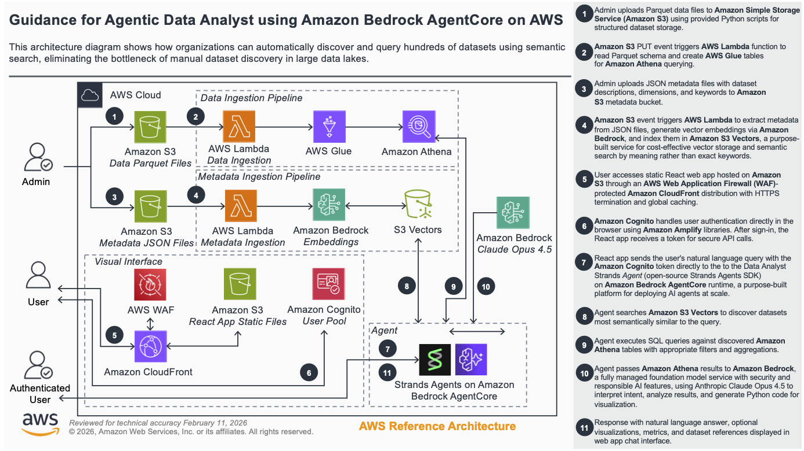

# Data Analyst Agent using Hundreds of Datasets on Amazon Athena

## Table of Contents

- [Data Analyst Agent using Hundreds of Datasets on Amazon Athena](#data-analyst-agent-using-hundreds-of-datasets-on-amazon-athena)
  - [Table of Contents](#table-of-contents)
  - [Overview](#overview)
    - [Demo Video](#demo-video)
    - [Notes](#notes)
    - [Cost](#cost)
    - [Sample Cost Table](#sample-cost-table)
  - [Architecture](#architecture)
    - [Ingestion Flow](#ingestion-flow)
    - [Query Flow](#query-flow)
  - [Design Decisions](#design-decisions)
    - [1. Coding Agent over Tool-Calling Agent](#1-coding-agent-over-tool-calling-agent)
    - [2. Agentic Search over Naïve RAG](#2-agentic-search-over-naïve-rag)
    - [3. Self-Explanatory Data via Parquet Dictionary Encoding](#3-self-explanatory-data-via-parquet-dictionary-encoding)
  - [Prerequisites](#prerequisites)
  - [Deployment Steps](#deployment-steps)
  - [Deployment Validation](#deployment-validation)
  - [Adding Your Own Datasets](#adding-your-own-datasets)
  - [Local Development](#local-development)
    - [Run the Agent Locally](#run-the-agent-locally)
    - [Run the UI Locally](#run-the-ui-locally)
  - [Benchmarks](#benchmarks)
    - [Dataset Search Benchmark](#dataset-search-benchmark)
    - [Agent Benchmark](#agent-benchmark)
  - [Next Steps](#next-steps)
  - [Cleanup](#cleanup)
  - [Notices](#notices)
  - [Authors](#authors)

## Overview
Organizations often manage hundreds of datasets across their data lakes, making it difficult for analysts to discover which datasets contain the information they need. Traditional keyword-based search falls short when users don't know the exact terminology or structure of available data. This creates a bottleneck where valuable data remains underutilized simply because it's hard to find.

This guidance provides a scalable approach for deploying a Data Analyst Agent that can query hundreds of datasets hosted on **Amazon Athena**. Built on the **Strands Agents** framework and the **[Strands Code Agent](https://pypi.org/project/strands-code-agent/)** library, and deployed on **AWS AgentCore**, the agent leverages semantic search powered by **Amazon S3 Vectors** to automatically identify and retrieve the most relevant datasets based on user queries.

For each new dataset added to the system, the admin must upload two files:
1. A **Parquet file** with the raw data, which initialises the corresponding Athena table.
2. A **JSON metadata file** with a dataset description, which creates a vector database entry enabling semantic discovery by the agent.

To showcase the solution's ability to handle hundreds of datasets, this guidance includes a ready-to-use script that downloads all `1,775` publicly available datasets from the Organisation for Economic Co-operation and Development (OECD) and the UK Office for National Statistics (ONS) and generates the corresponding Parquet data and JSON metadata files, ready to be uploaded. Additionally, a demo React Web-Application is provided, allowing users to interact with and query the agent through an intuitive interface.



### Demo Video

[](https://youtu.be/iD2zr2wUj6A)

### Notes

The sample datasets used in this guidance are sourced from the [UK Office for National Statistics (ONS)](https://www.ons.gov.uk/) and the [Organisation for Economic Co-operation and Development (OECD)](https://www.oecd.org/), publicly available open data providers. These datasets are independent of Amazon and do not represent Amazon data, customers, or business operations. They are used solely to demonstrate the solution's capability to handle hundreds of datasets at scale.

### Cost

You are responsible for the cost of the AWS services used while running this Guidance. As of January 2026, the cost for running this Guidance with the default settings in the US East (N. Virginia) is approximately $95.44 per month for processing 1,000 queries.

We recommend creating a [Budget](https://docs.aws.amazon.com/cost-management/latest/userguide/budgets-managing-costs.html) through [AWS Cost Explorer](https://aws.amazon.com/aws-cost-management/aws-cost-explorer/) to help manage costs. Prices are subject to change. For full details, refer to the pricing webpage for each AWS service used in this Guidance.

### Sample Cost Table

The following table provides a sample cost breakdown for deploying this Guidance with the default parameters in the US East (N. Virginia) Region for one month.

| AWS service  | Dimensions | Cost [USD] |
| ----------- | ------------ | ------------ |
| Amazon Bedrock foundation model (Anthropic Claude Haiku 4.5) | 1,000 Agent invocations per month  | $ 70.20 |
| Amazon Bedrock AgentCore runtime | 1,000 sessions per month | $ 14.06 |
| AWS Lambda | 317 dataset ingestion per month | $ 6.03 |
| Amazon Athena | 1000 requests per month | $ 4.88 |
| Amazon Simple Storage Service (S3) | 1 GB per month | $ 0.16 |
| Amazon CloudFront | 1000 requests per month | $ 0.11 |

## Architecture

The Data Analyst Agent answers natural-language questions over a corpus of structured datasets through two flows: an **ingestion flow** that registers datasets for query and discovery, and a **query flow** that runs whenever a user asks a question.

### Ingestion Flow

For each dataset, an admin uploads two files to the ingestion bucket: a Parquet file with the rows, and a JSON metadata file describing the dataset. S3 events trigger two Lambda functions:
1. One registers the Parquet file as an external table in the **AWS Glue Data Catalog** (queryable through Athena).
2. One embeds the metadata's `indexing-description` field into an **S3 Vectors** index.

From that point on, the dataset is both queryable and discoverable by the agent.

### Query Flow

A user signs in to the React web app (served behind Amazon CloudFront with AWS WAF and authenticated by Amazon Cognito) and asks a question in plain English. The web app invokes the agent on Amazon Bedrock AgentCore. The agent searches the relevant datasets from the S3 Vectors index, then reasons through the question by writing and executing Python code. It calls Athena to fetch data, joins datasets in pandas, generates a chart, and streams the final answer back to the UI.

## Design Decisions

Three architectural choices distinguish this solution from a generic RAG-over-tables pattern.

### 1. Coding Agent over Tool-Calling Agent

The conventional agent pattern is **tool calling**: the LLM emits structured calls to a fixed set of functions, and each result is JSON-encoded back into the prompt. This does not survive contact with real datasets — a single Athena query can return thousands of rows, burning most of the available tokens before reasoning starts.

Our agent is a **coding agent** built on the [strands-code-agent](https://pypi.org/project/strands-code-agent/) library. Instead of invoking structured tools, the agent writes Python code in a sandboxed REPL where domain capabilities are exposed as importable library functions. A 10,000-row pandas DataFrame stays as a native Python object in memory; only what the agent explicitly prints re-enters the LLM context.

In empirical evaluations, the code-generation paradigm achieves **+7% higher accuracy** while consuming **78% fewer input tokens**, completing tasks **56% faster**, and requiring **35% fewer reasoning cycles** compared to an equivalent tool-calling agent.

### 2. Agentic Search over Naïve RAG

Naïve RAG embeds the user's question, retrieves the top-K closest dataset descriptions, and includes them in the prompt. This breaks in two ways at scale:

- **Multi-topic questions.** *"Is there a relationship between healthcare spending per capita and avoidable mortality?"* has two topics whose descriptions sit in different regions of the embedding space. A single embedding misses half the data.
- **Vocabulary mismatch.** A user asks *"how many people are out of work?"*; the relevant dataset is described as *"labour market statistics"*.

We expose dataset discovery as a **tool the agent can call any number of times**. The agent receives the top-3 datasets up front, but if those are insufficient it calls `search_datasets` again with a reformulated query and recovers the missing datasets.

### 3. Self-Explanatory Data via Parquet Dictionary Encoding

Many institutional datasets store dimension values as internal codes (e.g., `PT_P5L` for *"Percentage of investment"*). An LLM cannot interpret these without a lookup table.

We replace codes with human-readable labels at ingestion time. The obvious objection is data bloat, but **Parquet's dictionary encoding** stores each unique string exactly once in a per-column dictionary — rows store small integer indices. Whether the dictionary entry reads `PT_P5L` or `Percentage of investment`, every row is the same tiny index. With column compression on top, the on-disk size barely moves.

Self-explanatory data is essentially free in Parquet, and expensive in CSV.

## Prerequisites
- AWS CLI configured with appropriate permissions
- Docker installed and running
- Python 3.10+
- AWS CDK bootstrapped (if first time):
  ```bash
  npm install -g aws-cdk
  cdk bootstrap
  ```

**Note:** This solution has been tested in the us-east-1 region but should work in other regions where all required services (Amazon Bedrock with the specified models, AgentCore, S3 Vectors, Athena, etc.) are available. Verify service availability in your target region before deployment. Web Application Firewall (WAF) will always be deployed to us-east-1 region.

## Deployment Steps

1. Clone the repository and install dependencies:
   ```bash
   pip install -r requirements.txt
   ```

2. From the `infrastructure` directory, deploy the stacks:
   ```bash
   cd infrastructure
   cdk deploy --all
   ```

3. From the `agent` directory, download and upload datasets:
   ```bash
   cd agent

   # Download and preprocess 337 ONS datasets
   python aws_data_analyst/datasets/ons/download_datasets.py
   python aws_data_analyst/datasets/ons/preprocess_datasets.py

   # Download 1,438 OECD datasets
   python aws_data_analyst/datasets/oecd/oecd_data.py

   # Upload all datasets to S3
   python aws_data_analyst/datasets/upload_datasets_to_s3.py
   ```

4. Grant access to the demo Web-App by creating a user in the Cognito User Pool:
   1. Open the AWS console → Cognito → select the `DataAnalystWebAppUserPool*` user-pool.
   2. Select `User management → Users` → click **Create user**.
   3. Enter a "User name" and a "Temporary password", then click **Create User**.

## Deployment Validation
After a successful CDK deployment, on the CloudFormation page of the AWS console you should see four stacks:
* `DataStack`: ingestion S3 bucket, ingestion Lambdas, Athena datasets database, S3 Vectors bucket and index.
* `AgentCoreStack`: ECR repository, CodeBuild project that builds and pushes the agent container, Amazon Bedrock AgentCore runtime resource, and IAM execution role.
* `WebAppStack`: Amazon Cognito user pool, S3 bucket for the React build, and CloudFront distribution.
* `WafStack`: AWS WAF web ACL attached to CloudFront (deployed in us-east-1).

On the S3 page you can see the `datasets-*` bucket that contains two folders:
* `datasets/`: containing the parquet data files.
* `metadata/`: containing the JSON metadata files.

On the CloudFront page you can see the "Domain name" of the deployed web-app.
Enter this domain name on any browser to load the demo web-app, and log-in with the user credentials that you created in the Cognito user-pool. The first time you log-in you will be instructed to change the temporary password to a new one.

Enter any query that could be supported by the available datasets, and the data-analyst will provide an answer.


Other example questions:
* Did Brexit change trade with the EU?
* What does the UK import from and export to the USA?
* When was the highest inflation rate in the UK?
* Is there a relationship between healthcare spending per capita and avoidable mortality?

## Adding Your Own Datasets

Adding a dataset requires two files uploaded to the ingestion S3 bucket:

**1. A Parquet file** (`datasets/<namespace>/<dataset-name>/data.parquet`) with the rows.

**2. A JSON metadata file** (`metadata/<namespace>/<dataset-name>/dataset.json`) describing the dataset:

```json
{
  "namespace": "oecd",
  "id": "dsd_sha_df_sha",
  "indexing-description": "OECD Dataset - Health expenditure and financing\nA System of Health Accounts 2011 provides an updated and systematic description of the financial flows related to the consumption of healthcare goods and services.",
  "usage-description": "OECD Dataset - Health expenditure and financing\nA System of Health Accounts 2011 provides an updated and systematic description of the financial flows related to the consumption of healthcare goods and services.\nDimensions:\n\t- ASSET_TYPE: Asset type. Possible values: \"Infrastructure\", \"Intellectual property products\", ..."
}
```

- The `indexing-description` is **embedded into the S3 Vectors index** (so the agent can discover the dataset).
- The `usage-description` is **injected into the prompt** when the dataset is retrieved.

Upload both files:
```bash
aws s3 cp data.parquet s3://datasets-<account-id>/datasets/<namespace>/<dataset-name>/
aws s3 cp dataset.json s3://datasets-<account-id>/metadata/<namespace>/<dataset-name>/
```

Two Lambda functions trigger automatically: one registers an external table in the Glue Data Catalog, the other embeds the `indexing-description` and adds a vector to the S3 Vectors index.

**Expanding codes to readable labels:** If your raw data uses internal codes, expand them to readable labels before writing the Parquet file:

```python
import pandas as pd
import pyarrow as pa
import pyarrow.parquet as pq

DIMENSION_LABELS = {
    "PT_P5L":  "Percentage of investment",
    "PT_P51G": "Percentage of gross fixed capital formation",
}

df = load_raw_data()
df["column-name"] = df["column-name"].map(DIMENSION_LABELS).fillna(df["column-name"])

pq.write_table(pa.Table.from_pandas(df), "data.parquet", compression="snappy")
```

Parquet's dictionary encoding stores each unique label exactly once, so expanding codes to full labels costs almost nothing on disk.

## Local Development

### Run the Agent Locally
```bash
cd agent
python -m aws_data_analyst.data_analyst_agent_service
```
Starts the agent on `http://localhost:8080`. Requires AWS credentials configured for Bedrock, S3, etc.

### Run the UI Locally

Connecting to the remote AgentCore endpoint:
```bash
./scripts/start-ui-local.sh
```

Connecting to a local agent on localhost:
```bash
./scripts/start-ui-local.sh --local
```

The script retrieves configuration from CloudFormation, generates `.env.local`, and starts the dev server. Infrastructure must be deployed first.

## Benchmarks
The `agent` directory contains two benchmarks, to compare the performance of different foundational models.

### Dataset Search Benchmark
To run the dataset search benchmark use the following script:
```
python aws_data_analyst/evaluation/benchmark_dataset_discovery.py
```

| Model                                     | Latency (ms) | Mean Recall@3 |
| ----------------------------------------- | ------------ | ------------- |
| amazon.nova-2-multimodal-embeddings-v1:0  |  326         |  78%          |
| cohere.embed-v4:0                         |  215         |  76%          |

### Agent Benchmark
To run the agent benchmark use the following script:
```
python aws_data_analyst/evaluation/benchmark_agent.py
```

| Model                                            | Median Latency (s) | Mean Cost ($) | Mean Score |
| ------------------------------------------------ | ------------------ | ------------- | ---------- |
| minimax.minimax-m2                               | 6.8                | 0.02          | 57%        |
| global.anthropic.claude-haiku-4-5-20251001-v1:0  | 2.8                | 0.07          | 50%        |
| global.anthropic.claude-sonnet-4-6               | 8.0                | 0.20          | 74%        |
| global.anthropic.claude-opus-4-6-v1              | 5.2                | 0.37          | 89%        |

## Next Steps
The system can work with any other dataset — simply upload its Parquet data file and JSON metadata file to the corresponding S3 bucket paths. See [Adding Your Own Datasets](#adding-your-own-datasets) for details.

To extend the agent further:
- Install the [strands-code-agent](https://pypi.org/project/strands-code-agent/) library and define custom Toolkits that expose your domain capabilities as importable Python functions.
- Read the [Strands Agents SDK documentation](https://strandsagents.com/) and the [Amazon Bedrock AgentCore documentation](https://docs.aws.amazon.com/bedrock/latest/userguide/agentcore.html).

## Cleanup

**1. Empty the S3 buckets** (ingestion bucket and Athena query-results bucket) before destroying stacks, otherwise CloudFormation will fail to delete them:
```bash
aws s3 rm s3://datasets-<account-id> --recursive
```

**2. Destroy the CloudFormation stacks:**
```bash
cd infrastructure
cdk destroy --all
```

## Notices
*Customers are responsible for making their own independent assessment of the information in this Guidance. This Guidance: (a) is for informational purposes only, (b) represents AWS current product offerings and practices, which are subject to change without notice, and (c) does not create any commitments or assurances from AWS and its affiliates, suppliers or licensors. AWS products or services are provided "as is" without warranties, representations, or conditions of any kind, whether express or implied. AWS responsibilities and liabilities to its customers are controlled by AWS agreements, and this Guidance is not part of, nor does it modify, any agreement between AWS and its customers.*

## Authors
* Emilio Monti
* Ozan Cihangir
* Luis Orus
